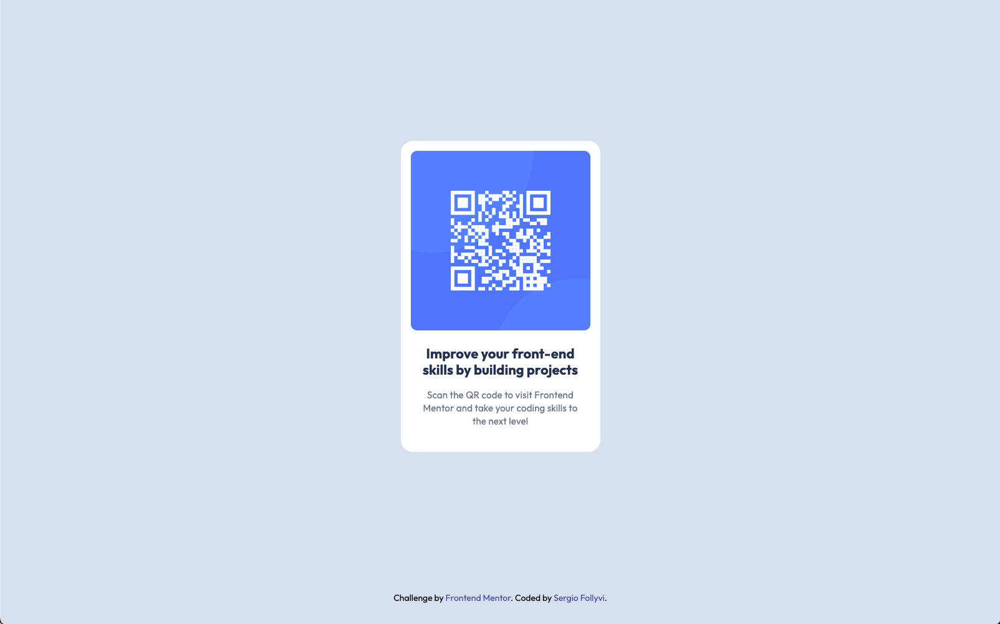

<!-- @format -->

# Frontend Mentor - QR code component

This is a solution to the [QR code component challenge on Frontend Mentor](https://www.frontendmentor.io/challenges/qr-code-component-iux_sIO_H). Frontend Mentor challenges help you improve your coding skills by building realistic projects.


## Table of contents

- [Frontend Mentor - QR code component](#frontend-mentor---qr-code-component)
  - [Table of contents](#table-of-contents)
  - [Overview](#overview)
    - [The challenge](#the-challenge)
    - [Screenshots](#screenshots)
    - [Links](#links)
  - [My process](#my-process)
    - [Built with](#built-with)
    - [What I learned](#what-i-learned)
  - [Author](#author)

## Overview

### The challenge

- Buil out the QR code component in the design preview and get it looking as close to the design as possible.

### Screenshots

Desktop


Mobile


### Links

- Solution URL: [Solution - github](https://github.com/serfoll/qr-code-component)
- Live Site URL: [QR Code Component](https://serfoll-fm-qr-code-component.netlify.app)

## My process

### Built with

- Semantic HTML5 markup
- CSS
- Flexbox

### What I learned

`box-sizing: border-box`: After resizing the QR code image there was an empty space to the right of the image. After some inspection without result, I remembered there's about `border-box` and after a quick google search I was able to remove the white space using `box-sizing: border-box` to include the padding in the calculation of the width and height of the card element. To ensure all elments get the right width and height I used:

```css
* {
  box-sizing: border-box;
}
```

## Author

- Frontend Mentor - [@serfoll](https://www.frontendmentor.io/profile/serfoll)
- Twitter - [@sergio_fol](https://www.twitter.com/sergio_fol)
